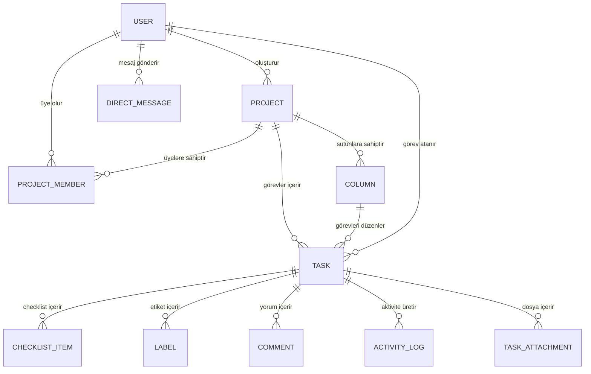

# Panovio - ER Diyagramı

Panovio veritabanı PostgreSQL üzerinde çalışmakta ve Prisma ORM ile yönetilmektedir.

Aşağıdaki diyagram sistemdeki temel veri modelleri ve ilişkilerini göstermektedir.

## Temel Modeller

### User

Sistemdeki kullanıcıları temsil eder. Kullanıcılar projelere katılabilir, görev alabilir ve ekip üyeleriyle mesajlaşabilir.

### Project

Panovio içerisindeki proje veya panoları temsil eder.

### ProjectMember

Kullanıcı ile proje arasındaki üyelik ilişkisini ve kullanıcının proje içerisindeki rolünü tutar.

Temel roller:

- MANAGER
- DEVELOPER

### Column

Kanban panosundaki görev sütunlarını temsil eder.

Örnek:

- Yapılacaklar
- Devam Edenler
- Tamamlandı

### Task

Proje içerisindeki görevleri temsil eder. Görevler başlık, açıklama, durum, öncelik, tarih ve atanan kullanıcı gibi bilgiler içerebilir.

### ChecklistItem

Bir görevin alt kontrol maddelerini temsil eder.

### Label

Görevlere eklenen etiketleri temsil eder.

### Comment

Görevler üzerinde kullanıcıların oluşturduğu yorumları temsil eder.

### ActivityLog

Projede ve görevlerde gerçekleşen işlemlerin aktivite geçmişini tutar.

### TaskAttachment

Görevlere yüklenen dosya eklerinin bilgilerini tutar.

### DirectMessage

Kullanıcılar arasındaki doğrudan mesajları temsil eder.

## Temel İlişkiler

- Bir kullanıcı birden fazla projeyle ilişkili olabilir.
- Bir proje birden fazla üyeye sahip olabilir.
- Bir proje birden fazla sütun ve görev içerebilir.
- Bir sütun birden fazla görev içerebilir.
- Bir kullanıcıya birden fazla görev atanabilir.
- Bir görev checklist, etiket, yorum, aktivite ve dosya ekleriyle ilişkilendirilebilir.
- Kullanıcılar birbirleriyle doğrudan mesajlaşabilir.